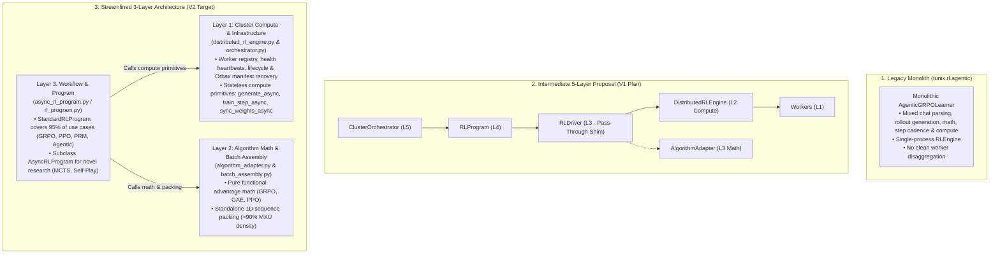
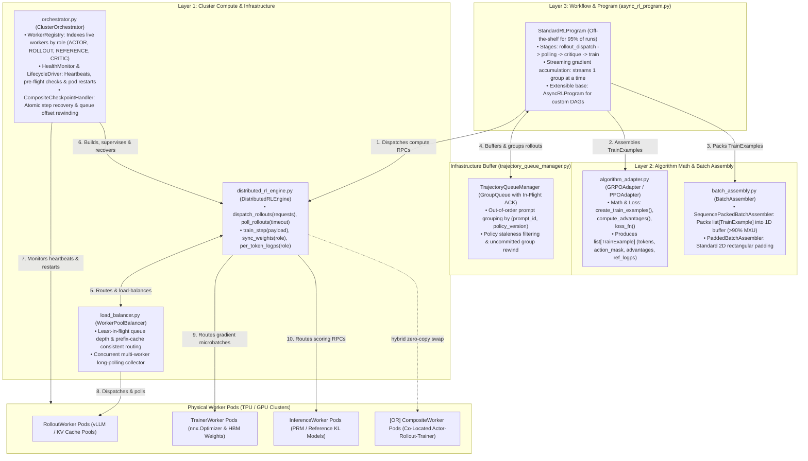
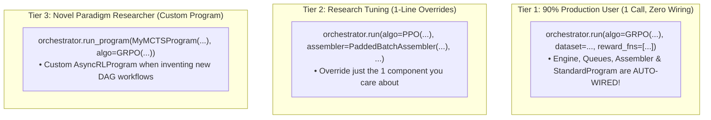
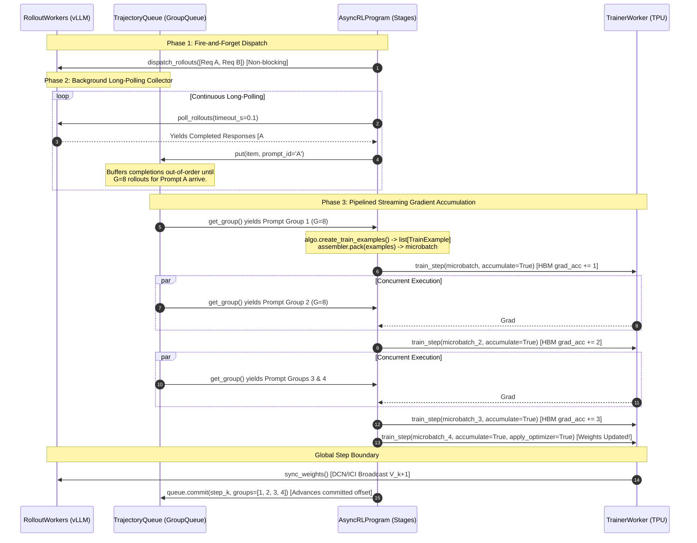
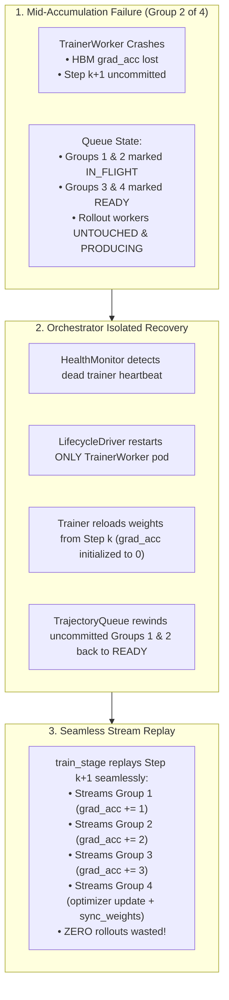
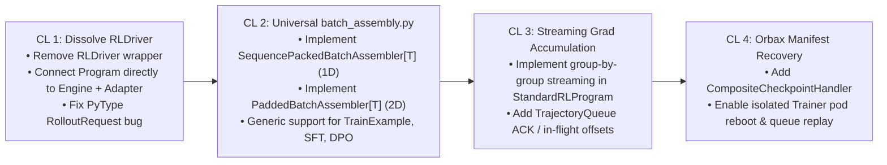

# Tunix RL Architecture V2: Streamlined 3-Layer Specification & Design Plan

> [!NOTE]
> This document defines the definitive **Version 2 (V2) Architectural Specification** for the Tunix Distributed RL stack. Based on architectural review and gap analysis of the initial prototype, V2 streamlines the previous 5-layer proposal into a high-performance, boilerplate-free **3-Layer Compositional Architecture**:
> 1. **Layer 3: Workflow & Program Layer** (`async_rl_program.py` / `rl_program.py`)
> 2. **Layer 2: Algorithm Math & Batch Assembly Layer** (`algorithm_adapter.py` & `batch_assembly.py`)
> 3. **Layer 1: Cluster Compute & Infrastructure Layer** (`distributed_rl_engine.py` & `orchestrator.py` with `trajectory_queue_manager.py`)
> 
> It details the **3-Tier Ergonomic User Experience** (Zero Boilerplate for 90% of users), **Long-Polling Rollout Pipelining & Streaming Gradient Accumulation** (zero-bubble pipelined execution), an **Orbax Composite Manifest Checkpointing** protocol for isolated trainer failure recovery without pipeline resets, standalone **1D Sequence Packing** (`batch_assembly.py`), a single off-the-shelf **`StandardRLProgram`** covering 95% of use cases, and complete end-to-end prototype code.

---

## 1. Executive Summary & Why V2 Was Streamlined

### 1.1. The Evolution from Monolith to V2
The Tunix RL architecture has evolved across three key milestones:



### 1.2. Eliminating the "Pass-Through Tax" of `RLDriver`
In the V1 design, `RLDriver` acted mostly as an unnecessary middleman:
- `driver.generate()` was a 1-line pass-through to `engine.generate()`.
- `driver.train_step()` was a 1-line pass-through to `engine.train_step()`.
- `driver.sync_weights()` was a 1-line pass-through to `engine.sync_weights()`.
- `driver.compute_advantages()` was a 1-line pass-through to `adapter.compute_advantages()`.

Every call required 4–6 hops across files. **In V2, `RLDriver` is completely dissolved:**
- **Compute & RPC Routing** lives in `DistributedRLEngine` (`distributed_rl_engine.py`).
- **Math & Loss Wiring** lives in `AlgorithmAdapter` (`algorithm_adapter.py`).
- **1D Sequence Packing & 2D Padding** lives in `BatchAssembler` (`batch_assembly.py`).
- **Workflow & Stage Cadence** lives in `RLProgram` (`async_rl_program.py`).

---

## 2. The Streamlined 3-Layer Architecture & Module Map



### 2.1. The 3-Tier Ergonomic User Experience (Zero Boilerplate)

To prevent users from having to manually instantiate 6 separate objects in their experiment scripts, `ClusterOrchestrator` provides **3 clean ergonomic tiers**:



---

## 3. Data Flow & Queue Management: Streaming Gradient Accumulation

In agentic RL, waiting for all $N$ prompt groups (e.g. 4 groups of $G=8$ rollouts = 32 rollouts total) before touching the trainer creates massive **GPU/TPU idle bubbles**. 

V2 implements **Long-Polling Rollout Pipelining & Streaming Gradient Accumulation with `TrainExample`s**:
1. **Fire-and-Forget Dispatch:** `rollout_dispatch_stage` streams `RolloutRequest`s across the worker pool using non-blocking RPCs (`await engine.dispatch_rollouts(requests)`).
2. **Long-Polling Collector & Load Balancer:** A dedicated `polling_stage` continuously long-polls completed responses from workers (`await engine.poll_rollouts()`) and feeds individual completions into `TrajectoryQueue`. The queue groups them by `prompt_id` and filters stale policy versions.
3. **Structured `TrainExample` Assembly:** As soon as **1 ready prompt group** ($G=8$ rollouts) is assembled by the queue, `algo.create_train_examples(group, rewards)` creates a typed `list[TrainExample]` attaching advantages, value targets, and observation loss masks (`action_mask=0`).
4. **Immediate Microbatch Execution:** `assembler.pack(train_examples)` packs the examples into 1D static buffers and immediately streams them to `await engine.train_step(payload)`. Gradients accumulate directly on accelerator HBM, and only on the $N$-th group does the trainer apply the optimizer update and broadcast new weights!



---

## 4. Isolated Failure Recovery: Atomic Manifest & Queue Offsets

When a Trainer worker pod crashes midway through gradient accumulation (e.g. at Group 2 of 4), **we must NOT restart rollout workers or discard in-flight queues**.



### The 4 Pillars of Isolated Recovery:
1. **Atomic Composite Manifest in Orbax:** Checkpoint directories (`step_k/`) contain an atomic manifest linking model weights, global step counter, dataset prompt index, and queue read offsets:
   ```json
   {
     "global_step": 42,
     "policy_version": 42,
     "dataset_prompt_idx": 130,
     "queue_read_offsets": {
       "raw_rollouts_q": 1040,
       "scored_rollouts_q": 1040
     }
   }
   ```
2. **In-Flight Acknowledgement (`ACK`) Semantics in `TrajectoryQueue`:** Dequeued items remain in the queue log marked as `IN_FLIGHT`. They are only permanently committed when `queue.commit(step)` is invoked after `sync_weights_async()`.
3. **Zero Partial Gradient Bleed:** On reboot, `TrainerWorker` reloads Step $k$ weights and zeroes out its physical gradient accumulator tensor (`grad_acc = 0`).
4. **Instant Stream Replay:** The queue returns uncommitted Groups 1 and 2 to `READY` state. `train_stage` streams Groups 1 through 4 again, cleanly completing Step $k+1$ without regenerating rollouts.

---

## 5. Complete Runnable Prototype Implementation

Here is the clean, production-ready prototype implementation of the V2 architecture:

### 5.1. Layer 1: `DistributedRLEngine`, `AbstractRLEngine` & `WorkerPoolBalancer`

```python
"""Distributed compute routing surface implementing AbstractRLEngine."""

from typing import Any, Mapping, Protocol, Sequence, runtime_checkable
import asyncio
from tunix.experimental.common import datatypes

@runtime_checkable
class AbstractRLEngine(Protocol):
  """Stateless compute primitives for distributed worker meshes."""
  async def dispatch_rollouts(self, requests: Sequence[datatypes.RolloutRequest]) -> None: ...
  async def poll_rollouts(self, timeout_s: float = 0.1) -> list[datatypes.RolloutResponse]: ...
  async def generate(self, prompts: Sequence[Any], **kwargs: Any) -> list[Any]: ...
  async def score(self, role: datatypes.Role, items: Sequence[Any], **kwargs: Any) -> list[float]: ...
  async def per_token_logps(self, role: datatypes.Role, items: Sequence[Any], **kwargs: Any) -> Any: ...
  async def train_step(self, payload: datatypes.RLTrainerPayload, role: datatypes.Role = datatypes.Role.ACTOR, **kwargs: Any) -> Any: ...
  async def sync_weights(self, role: datatypes.Role = datatypes.Role.ACTOR) -> int: ...


class WorkerPoolBalancer:
  """Load balancing, prefix-cache affinity, and concurrent long polling across worker replicas."""

  def __init__(self, workers: Sequence[Any]):
    self._workers = list(workers)
    self._in_flight: dict[int, int] = {i: 0 for i in range(len(workers))}

  def select_worker_for_request(self, req: datatypes.RolloutRequest) -> tuple[int, Any]:
    """Selects worker using least-in-flight queue depth or prefix-cache hash affinity."""
    # Prefix-cache routing: Hash system prompt prefix to maximize vLLM KV-cache reuse
    if "prefix_hash" in req.metadata:
      idx = req.metadata["prefix_hash"] % len(self._workers)
    else:
      # Least-in-flight worker
      idx = min(self._in_flight, key=self._in_flight.get)
    self._in_flight[idx] += 1
    return idx, self._workers[idx]

  async def poll_all_workers(self, timeout_s: float = 0.1) -> list[datatypes.RolloutResponse]:
    """Concurrently long-polls all active rollout workers."""
    tasks = [w.poll_responses(timeout_s=timeout_s) for w in self._workers]
    responses = await asyncio.gather(*tasks)
    completed = []
    for i, resp in enumerate(responses):
      if resp is not None:
        unwrap_fn = getattr(resp, "unwrap", None)
        res = unwrap_fn() if callable(unwrap_fn) else getattr(resp, "result", resp)
        if res is not None:
          items = res if isinstance(res, list) else [res]
          self._in_flight[i] = max(0, self._in_flight[i] - len(items))
          completed.extend(items)
    return completed


class DistributedRLEngine(AbstractRLEngine):
  """Worker-backed compute router dispatching RPCs across role pools."""

  def __init__(
      self,
      rollout_workers: Sequence[Any],
      trainer_workers: Mapping[datatypes.Role, Any],
      inference_workers: Mapping[datatypes.Role, Any] | None = None,
  ):
    self._rollout_workers = list(rollout_workers)
    self._balancer = WorkerPoolBalancer(rollout_workers)
    self._trainer_workers = dict(trainer_workers)
    self._inference_workers = dict(inference_workers or {})

  async def dispatch_rollouts(self, requests: Sequence[datatypes.RolloutRequest]) -> None:
    """Dispatches rollout requests across workers using the load balancer."""
    for req in requests:
      _, worker = self._balancer.select_worker_for_request(req)
      await worker.dispatch_task(method_name="generate", requests=[req])

  async def poll_rollouts(self, timeout_s: float = 0.1) -> list[datatypes.RolloutResponse]:
    """Long-polls completed rollout responses concurrently across all workers."""
    return await self._balancer.poll_all_workers(timeout_s=timeout_s)

  async def generate(self, prompts: Sequence[Any], **kwargs: Any) -> list[Any]:
    """Blocking rollout generation (dispatches chunked tasks and awaits completion)."""
    num_workers = len(self._rollout_workers)
    chunk_size = (len(prompts) + num_workers - 1) // num_workers
    tasks = []
    for i, worker in enumerate(self._rollout_workers):
      chunk = prompts[i * chunk_size : (i + 1) * chunk_size]
      if chunk:
        tasks.append(worker.asubmit("generate", prompts=chunk, **kwargs))
    results = await asyncio.gather(*tasks)
    return [item for sublist in results for item in (sublist if isinstance(sublist, list) else [sublist])]

  async def score(self, role: datatypes.Role, items: Sequence[Any], **kwargs: Any) -> list[float]:
    """Routes reward / PRM scoring requests to InferenceWorker pool."""
    worker = self._inference_workers[role]
    return await worker.asubmit("score", items=items, **kwargs)

  async def per_token_logps(self, role: datatypes.Role, items: Sequence[Any], **kwargs: Any) -> Any:
    """Evaluates reference model or actor per-token logprobs."""
    worker = self._inference_workers.get(role) or self._trainer_workers.get(role)
    return await worker.asubmit("per_token_logps", items=items, **kwargs)

  async def train_step(
      self,
      payload: datatypes.RLTrainerPayload,
      role: datatypes.Role = datatypes.Role.ACTOR,
      accumulate_gradients: bool = False,
      apply_optimizer: bool = True,
      skip_jit: bool = False,
  ) -> Any:
    """Executes atomic gradient accumulation / update on TrainerWorker."""
    worker = self._trainer_workers[role]
    return await worker.asubmit(
        "fwd_bwd",
        batch=payload,
        accumulate_gradients=accumulate_gradients,
        apply_optimizer=apply_optimizer,
        skip_jit=skip_jit,
    )

  async def sync_weights(self, role: datatypes.Role = datatypes.Role.ACTOR) -> int:
    """Executes accelerator-to-accelerator collective weight broadcast."""
    trainer = self._trainer_workers[role]
    sync_metadata = await trainer.asubmit("prepare_weight_sync")
    tasks = [w.asubmit("weight_sync", sync_metadata) for w in self._rollout_workers]
    await asyncio.gather(*tasks)
    return sync_metadata.new_policy_version
```

---

### 5.2. Layer 2A: Universal Batch Assembly (`batch_assembly.py`)

`batch_assembly.py` is a **universal, algorithm-agnostic tensor packing utility** parameterized over generic type `T` (e.g. `TrainExample`, `SFTExample`, `DPOPair`, or arbitrary user dataclasses / PyTrees).

```python
"""Universal, generic batch assembly, TrainExample DTO, 1D sequence packing, and 2D padding."""

import dataclasses
from typing import Any, Generic, Protocol, Sequence, TypeVar
import numpy as np
from tunix.experimental.common import datatypes

T = TypeVar("T")

@dataclasses.dataclass(slots=True)
class TrainExample:
  """Self-contained training example produced by AlgorithmAdapter."""
  prompt_tokens: np.ndarray             # [L_prompt]
  completion_tokens: np.ndarray         # [L_completion]
  action_mask: np.ndarray               # [L_completion] (1 for model tokens, 0 for tool observations)
  advantage: float | np.ndarray         # Scalar (GRPO) or [L_completion] (token-level GAE)
  value_target: float | None = None      # Target for Critic MSE loss (PPO)
  old_logprobs: np.ndarray | None = None # [L_completion] Rollout policy logprobs
  ref_logprobs: np.ndarray | None = None # [L_completion] Reference model logprobs
  metadata: dict[str, Any] = dataclasses.field(default_factory=dict)


class BatchAssembler(Generic[T], Protocol):
  """Universal batch assembly protocol for any dataclass, dict, or PyTree."""
  def pack(self, items: Sequence[T]) -> list[datatypes.RLTrainerPayload]: ...


class SequencePackedBatchAssembler(Generic[T]):
  """1D Sequence Packing: Concatenates variable-length items into dense [1, max_packed_len] static buffers.
  
  Achieves >90% MXU compute density on TPUs/GPUs with Flash/FlexAttention.
  Works out-of-the-box on TrainExample (RL), SFTExample (Supervised), DPOPair (Preference), or custom PyTrees.
  """
  def __init__(self, max_packed_len: int = 8192, pad_id: int = 0):
    self.max_packed_len = max_packed_len
    self.pad_id = pad_id

  def pack(self, items: Sequence[T]) -> list[datatypes.RLTrainerPayload]:
    """Bin-packs arbitrary dataclass items into dense 1D buffers with segment boundaries."""
    # 1. First-fit decreasing 1D bin-packing on sequence lengths
    # 2. Generates cu_seqlens / segment_ids for block-diagonal attention kernels
    # 3. Static shape guarantee: pads trailing buffer slots with loss_mask = 0
    return self._pack_1d_buffers(items, self.max_packed_len)


class PaddedBatchAssembler:
  """Simple 2D Rectangular Batching: pads into standard [batch_size, P + C] tensors.

  Row layout follows the `TrainerPayload` contract: a LEFT-padded prompt of
  width `max_prompt_length` concatenated with a RIGHT-padded completion of
  width `max_response_length`. Because the boundary is identical on every row,
  completion-aligned tensors stay in completion space `[B, C]` and remain in
  register with `completion_ids`.

  NOTE: v1 is concrete on `RLTrainerPayload` rather than `Generic[T]`. A generic
  version needs a field-extractor callback (T -> token/mask/advantage arrays);
  that is deferred until SFT/DPO paths actually land.
  """
  def __init__(
      self,
      *,
      batch_size: int = 4,
      max_prompt_length: int = 512,
      max_response_length: int = 1536,
      pad_id: int = 0,
  ):
    ...

  def pack(
      self, items: Sequence[datatypes.RLTrainerPayload]
  ) -> list[datatypes.RLTrainerPayload]:
    """Pads items into rectangular 2D batches [B, P + C]."""
    ...
```

#### `PaddedBatchAssembler` output field shapes

| Field | Shape | Semantics |
| --- | --- | --- |
| `token_ids` | `[B, P + C]` | left-padded prompt ++ right-padded completion |
| `token_mask` | `[B, P + C]` | 1 on real (non-pad) tokens — **attention**, not loss |
| `loss_mask` | `[B, P + C]` | 0 over the prompt, action mask over the completion |
| `action_mask` | `[B, P + C]` | same as `loss_mask` |
| `prompt_ids` / `prompt_mask` | `[B, P]` | |
| `completion_ids` / `completion_mask` | `[B, C]` | `completion_mask` excludes tool-observation tokens |
| `advantages` | `[B, C]` | scalar advantages are broadcast over the completion |
| `ref_/old_per_token_logps`, `returns`, `old_values`, `sampler_is_weights` | `[B, C]` | emitted for the whole batch as soon as **any** row carries them; rows that do not are zero-filled so row `b` always describes item `b` |
| `metadata["num_real_rows"]` | `int` | rows before trailing zero padding |

`segment_ids` / `segment_positions` stay `None`: they describe 1D packing segments and carry no meaning for rectangular batches.

#### Reusing `BatchAssembler` Across Different Paradigms:
```python
# 1. RL Rollout Training
rl_assembler = SequencePackedBatchAssembler[TrainExample](max_packed_len=8192)
rl_microbatches = rl_assembler.pack(train_examples)

# 2. Supervised Fine-Tuning (SFT)
sft_assembler = SequencePackedBatchAssembler[SFTExample](max_packed_len=8192)
sft_microbatches = sft_assembler.pack(sft_examples)

# 3. Simple 2D Rectangular Batching (RL payloads)
padded_assembler = PaddedBatchAssembler(
    batch_size=8, max_prompt_length=512, max_response_length=1536
)
padded_batches = padded_assembler.pack(trainer_payloads)
# DPO / SFT reuse of PaddedBatchAssembler awaits the field-extractor API above.
```

---

### 5.3. Layer 2B: `AlgorithmAdapter` Math & Loss Wiring ([algorithm_adapter.py](https://github.com/google/tunix/blob/main/experimental/orchestrator/algorithm_adapter.py))

```python
"""Algorithm math, GAE / GRPO advantages, loss functions, and TrainExample assembly."""

import abc
from typing import Any, Callable, Sequence
import jax.numpy as jnp
import numpy as np
from tunix.experimental.orchestrator import batch_assembly

class AlgorithmAdapter(abc.ABC):
  """Abstract algorithm adapter for returns math, advantages, and loss functions."""

  def __init__(self, group_size: int = 8, mini_batch_size: int = 4, max_turns: int = 1, max_packed_len: int = 8192):
    self.group_size = group_size
    self.mini_batch_size = mini_batch_size
    self.max_turns = max_turns
    self.max_packed_len = max_packed_len
    self.requires_reference_kl = False
    self.has_critic = False
    self.requires_old_logprobs = False

  @abc.abstractmethod
  def compute_advantages(self, rewards: np.ndarray | jnp.ndarray, **kwargs: Any) -> jnp.ndarray: ...

  @abc.abstractmethod
  def create_train_examples(
      self,
      group: Any,
      rewards: list[float],
      ref_logps: Any | None = None,
  ) -> list[batch_assembly.TrainExample]:
    """Assembles scored trajectories and computed advantages into typed TrainExamples."""
    ...

  @abc.abstractmethod
  def loss_fn(self) -> Callable[..., Any]:
    """Returns the JIT-compiled loss function executed on TrainerWorker."""
    ...


class GRPOAdapter(AlgorithmAdapter):
  """Group Relative Policy Optimization (GRPO) adapter."""

  def compute_advantages(self, rewards: np.ndarray | jnp.ndarray, num_generations: int = 8) -> jnp.ndarray:
    """Computes group-normalized advantages: (r - mean(group)) / (std(group) + 1e-6)."""
    r = jnp.asarray(rewards, dtype=jnp.float32).reshape(-1, num_generations)
    mean = jnp.mean(r, axis=-1, keepdims=True)
    std = jnp.std(r, axis=-1, keepdims=True)
    advs = (r - mean) / (std + 1e-6)
    return advs.reshape(-1)

  def create_train_examples(
      self,
      group: Any,
      rewards: list[float],
      ref_logps: Any | None = None,
  ) -> list[batch_assembly.TrainExample]:
    """Packages group trajectories, advantages, and tool observation masks into TrainExamples."""
    advs = self.compute_advantages(rewards, num_generations=self.group_size)
    examples = []
    for i, traj in enumerate(group.trajectories):
      examples.append(
          batch_assembly.TrainExample(
              prompt_tokens=traj.prompt_tokens,
              completion_tokens=traj.completion_tokens,
              action_mask=traj.action_mask,  # 0 for tool observations, 1 for assistant tokens
              advantage=float(advs[i]),
              ref_logprobs=ref_logps[i] if ref_logps is not None else None,
          )
      )
    return examples

  def loss_fn(self) -> Callable[..., Any]:
    """GRPO clipped surrogate loss with beta * KL penalty."""
    def _loss(params, batch):
      # JAX / flax.nnx forward pass + ratio * A - beta * KL
      ...
    return _loss


class PPOAdapter(AlgorithmAdapter):
  """Generalized Advantage Estimation (GAE) and PPO Actor-Critic adapter."""

  def __init__(self, gamma: float = 0.99, lam: float = 0.95, **kwargs: Any):
    super().__init__(**kwargs)
    self.gamma = gamma
    self.lam = lam
    self.has_critic = True
    self.requires_reference_kl = True
    self.requires_old_logprobs = True

  def compute_advantages(self, rewards: np.ndarray, values: np.ndarray, **kwargs: Any) -> tuple[jnp.ndarray, jnp.ndarray]:
    """Computes GAE advantages and value function regression targets."""
    # delta_t = r_t + gamma * V(s_{t+1}) - V(s_t)
    # A_t = sum (gamma * lam)^l * delta_{t+l}
    return gae_advantages, value_targets

  def create_train_examples(self, group: Any, rewards: list[float], ref_logps: Any | None = None) -> list[batch_assembly.TrainExample]:
    # Builds TrainExamples with GAE advantages, value targets, and old_logprobs
    ...
```

---

### 5.4. Layer 3: `StandardRLProgram` & `AsyncRLProgram` ([async_rl_program.py](https://github.com/google/tunix/blob/main/experimental/orchestrator/async_rl_program.py))

```python
"""Off-the-shelf StandardRLProgram with long-polling rollout collector and TrainExample pipeline."""

import asyncio
from collections.abc import Callable, Iterable
from typing import Any
from tunix.experimental.common import datatypes
from tunix.experimental.orchestrator import algorithm_adapter
from tunix.experimental.orchestrator import batch_assembly
from tunix.experimental.orchestrator import distributed_rl_engine

class AsyncRLProgram:
  """Base class for asynchronous multi-stage DAG workflows."""

  def __init__(self):
    self._is_running = False

  def make_group_queue(self, name: str, group_size: int = 1) -> Any:
    """Requests an infrastructure-managed, checkpointable TrajectoryQueue."""
    return TrajectoryQueueManager(group_size=group_size)


class StandardRLProgram(AsyncRLProgram):
  """Single standard program handling 95% of use cases with long-polling rollouts."""

  def __init__(
      self,
      dataset: Iterable[Any],
      algo: algorithm_adapter.AlgorithmAdapter,
      reward_fns: list[Callable[..., Any]],
      assembler: batch_assembly.BatchAssembler | None = None,
  ):
    super().__init__()
    self.dataset = dataset
    self.algo = algo
    self.reward_fns = reward_fns
    self.assembler = assembler or batch_assembly.SequencePackedBatchAssembler(max_packed_len=algo.max_packed_len)
    self.raw_q = self.make_group_queue("raw", group_size=algo.group_size)
    self.scored_q = self.make_group_queue("scored", group_size=algo.group_size)
    self.current_policy_version = 0

  async def rollout_dispatch_stage(self, engine: distributed_rl_engine.DistributedRLEngine):
    """Stage 1A: Dispatches rollout requests across workers asynchronously (fire-and-forget)."""
    for prompt_idx, prompt_item in enumerate(self.dataset):
      if not self._is_running:
        break

      prompt_id = f"prompt_{prompt_idx}"
      group_id = f"group_{prompt_idx}"
      requests = []
      for g_idx in range(self.algo.group_size):
        req = datatypes.RolloutRequest(
            request_id=f"req_{prompt_idx}_{g_idx}",
            prompt=prompt_item,
            prompt_id=prompt_id,
            group_id=group_id,
            target_policy_version=self.current_policy_version,
            max_turns=self.algo.max_turns,
            metadata={"group_id": group_id, "pair_index": g_idx},
        )
        requests.append(req)

      await engine.dispatch_rollouts(requests)

  async def polling_stage(self, engine: distributed_rl_engine.DistributedRLEngine):
    """Stage 1B: Long-polls completed worker rollout responses into the grouping queue."""
    while self._is_running:
      try:
        completed_responses = await engine.poll_rollouts(timeout_s=0.1)
        if completed_responses:
          for resp in completed_responses:
            traj_item = datatypes.TrajectoryItem.from_rollout_response(resp)
            await self.raw_q.put(traj_item)
        else:
          await asyncio.sleep(0.01)
      except asyncio.CancelledError:
        break

  async def critique_stage(self, engine: distributed_rl_engine.DistributedRLEngine):
    """Stage 2: Scores rewards, neural PRMs, and reference KL logprobs."""
    async for group in self.raw_q:
      rewards = [fn(group) for fn in self.reward_fns]
      ref_logps = None
      if self.algo.requires_reference_kl:
        ref_logps = await engine.per_token_logps(datatypes.Role.REFERENCE, group)
      await self.scored_q.put(group, rewards=rewards, ref_logps=ref_logps)

  async def train_stage(self, engine: distributed_rl_engine.DistributedRLEngine, num_steps: int):
    """Stage 3: Streaming gradient accumulation with TrainExamples."""
    for step in range(num_steps):
      uncommitted_groups = []
      for group_idx in range(self.algo.mini_batch_size):
        group = await self.scored_q.get_group()
        uncommitted_groups.append(group)

        # 1. Assembles self-contained TrainExamples (math + observation masks)
        train_examples = self.algo.create_train_examples(group, group.rewards, ref_logps=group.ref_logps)
        
        # 2. 1D Sequence packing into hardware-sized microbatches
        microbatches = self.assembler.pack(train_examples)

        # 3. Streaming gradient accumulation on accelerator HBM
        is_final = (group_idx == self.algo.mini_batch_size - 1)
        for batch in microbatches:
          await engine.train_step(
              batch,
              role=datatypes.Role.ACTOR,
              accumulate_gradients=True,
              apply_optimizer=is_final,
          )

      # 4. Global step boundary: collective weight sync & queue commit
      self.current_policy_version = await engine.sync_weights(role=datatypes.Role.ACTOR)
      self.scored_q.commit(step, groups=uncommitted_groups)

  async def run_async(self, engine: distributed_rl_engine.DistributedRLEngine, num_steps: int):
    """Launches all stages concurrently on event loop."""
    self._is_running = True
    train_task = asyncio.create_task(self.train_stage(engine, num_steps))
    tasks = [
        asyncio.create_task(self.rollout_dispatch_stage(engine)),
        asyncio.create_task(self.polling_stage(engine)),
        asyncio.create_task(self.critique_stage(engine)),
        train_task,
    ]
    try:
      await train_task
    finally:
      self._is_running = False
      for t in tasks:
        if not t.done():
          t.cancel()
```

---

### 5.5. Infrastructure Glue: `ClusterOrchestrator` ([orchestrator.py](https://github.com/google/tunix/blob/main/experimental/orchestrator/orchestrator.py))

```python
"""Cluster Infrastructure Coordinator managing health, lifecycle, and program execution."""

class ClusterOrchestrator:
  """Supervises cluster hardware, health monitoring, and program execution."""

  def __init__(self, config: Any):
    self.config = config
    self.registry = WorkerRegistry()
    self.lifecycle = LifecycleDriver(self.registry)
    self.monitor = HealthMonitor(self.registry)
    self.engine = None

  def __enter__(self) -> "ClusterOrchestrator":
    """Interactive context manager bring-up."""
    self.bring_up()
    return self

  def __exit__(self, exc_type, exc_val, exc_tb) -> None:
    self.shutdown()

  def bring_up(self) -> None:
    self.lifecycle.bring_up()
    self.monitor.start_heartbeats()
    self.engine = self._create_engine()

  def shutdown(self) -> None:
    self.monitor.close()
    self.lifecycle.shutdown()

  def _create_engine(self) -> DistributedRLEngine:
    return DistributedRLEngine(
        rollout_workers=self.registry.group(datatypes.Role.ROLLOUT).members(),
        trainer_workers={
            datatypes.Role.ACTOR: self.registry.group(datatypes.Role.ACTOR).members()[0]
        },
    )

  def run(
      self,
      algo: algorithm_adapter.AlgorithmAdapter,
      dataset: Any,
      reward_fns: list[Callable[..., Any]],
      assembler: batch_assembly.BatchAssembler | None = None,
      program: AsyncRLProgram | None = None,
      num_steps: int = 1000,
  ) -> None:
    """Managed Program Submission: auto-wires Engine, Assembler, Queues & StandardProgram."""
    if self.engine is None:
      self.bring_up()

    active_assembler = assembler or batch_assembly.SequencePackedBatchAssembler(
        max_packed_len=algo.max_packed_len
    )
    active_program = program or StandardRLProgram(
        dataset=dataset,
        algo=algo,
        reward_fns=reward_fns,
        assembler=active_assembler,
    )
    
    # Executes stages concurrently on event loop
    asyncio.run(active_program.run_async(self.engine, num_steps))
```

---

## 6. How the 4 Major RL Variants Look to Users

### Case 1: Standard GRPO (Math / Rule Rewards)
```python
orchestrator = ClusterOrchestrator(config)
orchestrator.run(
    algo=GRPOAdapter(group_size=8, mini_batch_size=4),
    dataset=math_prompts,
    reward_fns=[math_rule_verifier],
)
```

### Case 2: GRPO with Neural PRM & Reference Model KL
```python
algo = GRPOAdapter(group_size=8, mini_batch_size=4)
algo.requires_reference_kl = True  # Automatically evaluates Role.REFERENCE logprobs!

orchestrator.run(
    algo=algo,
    dataset=code_prompts,
    reward_fns=[neural_prm_scorer],
)
```

### Case 3: PPO Actor-Critic (Learned Value Function)
```python
orchestrator.run(
    algo=PPOAdapter(gamma=0.99, lam=0.95),  # Automatically trains Role.ACTOR and Role.CRITIC!
    dataset=dialog_prompts,
    reward_fns=[human_preference_reward_model],
)
```

### Case 4: Multi-Turn Agentic Tool Calling (Docker Sandbox)
```python
orchestrator.run(
    algo=GRPOAdapter(group_size=4, max_turns=10),  # Auto-masks observations with action_mask=0!
    dataset=web_browser_tasks,
    reward_fns=[task_success_evaluator],
)
```

---

## 7. Phased Implementation & Execution Roadmap

To transition cleanly from the prototype in CL 959796292 to the streamlined V2 architecture, we execute in **4 self-contained CLs**:



| CL Number | Phase | Scope & Key Actions | Verification Target |
| :---: | :---: | :--- | :--- |
| **CL 1** | **Streamlined Core** | • Delete `rl_driver.py` and pass-through shims.<br/>• Update `RLProgram` and `AsyncRLProgram` to take `(engine, algo)`.<br/>• Fix `RolloutRequest.group_id` pytype error in `datatypes.py` / `async_rl_program.py`.<br/>• Wire `TrainerWorker.per_token_logps` in `DistributedRLEngine`. | `test //third_party/py/tunix/experimental/orchestrator:all` |
| **CL 2** | **Universal Batch Assembly** | • Introduce `batch_assembly.py` (`BatchAssembler[T]` protocol, `SequencePackedBatchAssembler[T]` for 1D token packing, and `PaddedBatchAssembler[T]` for 2D rectangular padding).<br/>• Support universal packing across RL (`TrainExample`), Supervised (`SFTExample`), and Preference (`DPOPair`) dataclasses.<br/>• Add block-diagonal attention mask generation and tool observation loss masking (`action_mask = 0`). | `test //third_party/py/tunix/experimental/orchestrator:all` |
| **CL 3** | **Streaming & Queue ACK** | • Implement streaming gradient accumulation in `StandardRLProgram` with `TrainExample` pipeline.<br/>• Add uncommitted in-flight buffer and `queue.commit()` to `TrajectoryQueueManager`. | `test //third_party/py/tunix/experimental/orchestrator:all` |
| **CL 4** | **Isolated Recovery** | • Implement Orbax `CompositeCheckpointHandler` (`manifest.json` with step, model weights, queue offsets).<br/>• Wire `LifecycleDriver.restart_worker(role=Role.ACTOR)` and queue seek on failure. | `test //third_party/py/tunix/experimental/orchestrator:all` |
